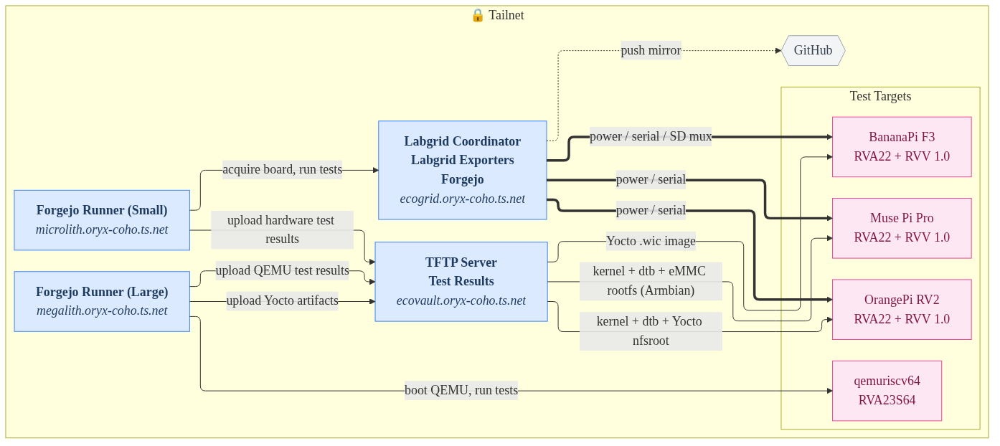

# boardgarden

tgamblin's boardfarm repo, built for testing RISC-V development boards with [Labgrid](https://github.com/labgrid-project/labgrid) and [Forgejo](https://forgejo.org/) Actions

## Table of Contents

- [Motivation](#motivation)
  - [Why Forgejo?](#why-forgejo)
  - [Why Labgrid?](#why-labgrid)
- [Network Diagram](#network-diagram)
- [Usage](#usage)
  - [.forgejo](#forgejo)
  - [boards](#boards)
  - [systemd_services](#systemd-services)
  - [udev](#udev)
  - [workbench](#workbench)

## Motivation

As part of the [RISE Project](https://riseproject.dev/),
[BayLibre](https://baylibre.com/) is improving support for RISC-V hardware and
software within the [Yocto Project](https://www.yoctoproject.org/). This
manifests in two main categories:

1. Triaging issues discovered while building and performing runtime testing of
   RISC-V systems using the
   [openembedded-core](https://git.openembedded.org/openembedded-core/) layer
   (which supports RISC-V via QEMU-based `qemuriscv32` and `qemuriscv64`
   `MACHINE` options)
2. Improving the [meta-riscv](https://github.com/riscv/meta-riscv) layer's
   support for widely-available RISC-V development boards, and ensuring it
   remains compliant with Yocto Project compatibility standards

`boardgarden` was built to address these challenges in an automated fashion, and
to serve as a useful reference to others who may want to build out their own
automated testing infrastructure.

### Why Forgejo?

1. Broadly compatible with GitHub Actions (therefore familiar to many users)
2. Convenient features for a forge (repository mirroring and sync, container
   registry, issue tracking, statistics, wiki)
3. Lightweight

### Why Labgrid?

1. Mature project with existing support for automated remote control of many
   devices, including USB-to-UART bridges, power switches, and [USB SD Mux](https://linux-automation.com/en/products/usb-sd-mux.html)
2. Hardware details abstracted away from user
3. Simple YAML configuration files
4. Uses `pytest` for test suites

## Network Diagram

## Usage

### .forgejo

These should mostly just work on a sufficiently-resourced Forgejo instance with
Actions enabled. Each pipeline is intended to be run automatically on a nightly
or weekly schedule. Most of the workflows within are intended for testing some
combination of:

- Packages whose test suites are known to have intermittent failure issues when
  run on `qemuriscv64` in the Yocto Project [Autobuilder](https://autobuilder.yoctoproject.org/valkyrie/)
- Board support packages (BSPs) provided by the
  [meta-riscv](https://github.com/riscv/meta-riscv) layer for various RISC-V
  development boards
- The meta-riscv layer's compliance against the
  [yocto-check-layer-wrapper](https://git.openembedded.org/openembedded-core/tree/scripts/yocto-check-layer-wrapper)
  script

The `bitbake-configs` directory contains templates for running Yocto-specific
workflows, while the `dockerfiles` directory contains definitions for the
`container-builder`, `labgrid-operator`, and `yocto-builder` container images
stored in the registry.

The following secrets are in use:

- `LG_EXPORTER_SSH_KEY` for allowing runner access to the Labgrid exporter machine
- `REGISTRY_TOKEN` and `REGISTRY_USERNAME` for pushing container images to the internal registry
- `REPORT_SSH_KEY` for copying test reports to the web server
- `TFTP_SERVER_SSH_KEY` for copying build artifacts to the TFTP server

### boards

This entire subdirectory is meant to be used with
[uv](https://docs.astral.sh/uv/) for installing and managing Python projects. It
includes a `common` module, which the `pyproject.toml` files are used to help
install in the virtualenv. This allows re-use of various Labgrid strategy
functions and pytest fixtures across multiple boards, since the fundamental
actions used (such as setting a TFTP server's IP address on the U-Boot prompt)
are more or less the same.

Assuming you have `uv` installed, you can set up the Python virtual environment
with all of the necessary modules by doing:

1. `cd boards`
2. `uv sync`

Using the board configurations will depend on how you have structured your
Labgrid deployment (see the [docs](https://labgrid.readthedocs.io/en/latest/)
for more details). Assuming that you have created a place called
`bf-muse-pi-pro` and exported the corresponding resources in
`boards/muse-pi-pro/exporter.yaml` with an appropriate matching pattern, you
should be able to invoke the labgrid CLI using `uv run`, e.g.:

1. `uv run labgrid-client -p bf-muse-pi-pro acquire`
2. `uv run labgrid-client -p bf-muse-pi-pro -c muse-pi-pro/client.yaml -s tftp con`

Or, if you want to run the test suite, you can do:

1. `uv run labgrid-client -p bf-muse-pi-pro acquire`
2. `uv run pytest -vvv --html=report.html --self-contained-html muse-pi-pro`

These same general concepts are employed by the pipelines inside the
`.forgejo/workflows` directory, so that should be considered a more complete
reference.

### systemd_services

Examples of how to create systemd services for running the Labgrid coordinator
and exporter processes on one or more systems.

### udev

udev rules for enabling the [BayLibre
Copilot](https://github.com/BayLibre/Copilot) board on a system to perform
remote power control to boards under test. These have only been deployed thus
far on Debian-based systems, where the `/sys/class/gpio` path exists and the
necessary Linux kernel configuration is enabled.

### workbench

Labgrid exporter and client configurations for use with the devices on my desk,
namely:

- BayLibre Copilot
- USBSerialPort device (USB to UART adapter)
- Rigol DS1054Z oscilloscope
- Sigilent SDG1032X function/waveform generator

Note that support for controlling the last two is still under development in
labgrid. See upstream issue
[#1835](https://github.com/labgrid-project/labgrid/pull/1835).
